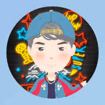
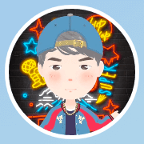
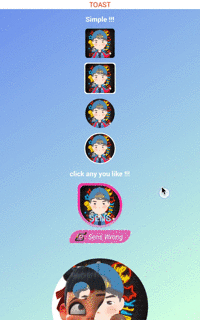

## 开源啦·开源啦 Android 超炫酷 超好用 的 裁切布局 一个布局搞定所有裁切

### 你遇到过怎样的图片裁切需求？

#### 1. 圆角矩形


#### 2. 带边框的圆角矩形


#### 3. 圆形



#### 4. 带边框的圆形



### 你又遇到过怎样奇怪的布局需求？

#### 1. 异形布局


#### 2. 阴阳布局


#### 3. 还是心形布局


所有这些，都可以用一个**ClipLayout**布局搞定

更重要的是

它会根据透明通道，重新调度**触摸事件**，所以事件会符合物理现象的进行图层穿透

请看展示效果



**它不止是裁切图片的利器，也是裁切布局的利器**

例如：上图中**心形布局**中的scrollview已经被自动裁切，即便滑动，也不影响裁切效果

阴阳布局的旋转过程，也没有因为旋转而忘记点击事件的重新分配

## 这么好的东西，会不会很难用呢？

当然不会啦，请看带边框圆形图片的布局代码


Include_circle_border.xml

```xml
<com.sens.widget.ClipLayout xmlns:android="http://schemas.android.com/apk/res/android"
    android:layout_width="64dp"
    android:layout_height="64dp">

    <View
        android:layout_width="match_parent"
        android:layout_height="match_parent"
        android:background="@drawable/oval" />

    <com.sens.widget.ClipMask
        android:layout_width="match_parent"
        android:layout_height="match_parent"
        android:layout_margin="2dp"
        android:background="@drawable/oval" />

    <ImageView
        android:layout_width="match_parent"
        android:layout_height="match_parent"
        android:layout_margin="2dp"
        android:src="@drawable/sens" />
</com.sens.widget.ClipLayout>
```

第一层的oval是白色的圆形shape

第二层的mask同样使用oval作为模版

第三层的image是正常的图像

通过上面的代码，想必你已经看出来了，**ClipLayout**整体分为三层结构：

**ClipLayout**就是裁切的舞台(它负责所有裁切任务的调度)，**ClipMask**就是裁切的模版。当然了 **ClipLayout**也可以包含多个**ClipMask**，但是**ClipMask**必需是**ClipLayout**的直接子View，否则它们的效果和FrameLayout无异。

没有**ClipMask**的**ClipLayout**和FrameLayout的效果没有差异，因为它们均继承自FrameLayout，更复杂的模版和布局，写在它们的xml内部即可。

到这里想必你已经明白了:

**ClipMask**是裁切模版，只取透明通道，**ClipMask**默认对**ClipMask**之下的视图(即背景层)执行**打洞**操作，默认对**ClipMask**上层(即内容层)执行**切割**操作

当然了，默认行为是可以随时修改的

你可以通过修改**ClipLayout** 中的**isReversal**属性动态的使它的裁切效果反向。

即：如果 **isReversal == true (默认false)** 那么

**ClipMask**对**ClipMask**之下的视图(即背景层)执行**切割**操作，对**ClipMask**上层(即内容层)执行**打洞**操作

## 讲到这里，请问：这么好的东西，会不会有兼容问题呢？

好消息是，**ClipLayout** 向下兼容至**安卓2.3.7** 向上兼容至**安卓12.0** 是的，它不存在兼容问题，放心用

## 那这么好的东西，会不会增加项目的重量呢？

**它的代码不足200行。**

200行你用不了吃亏，也用不了上当，走过路过，**点赞收藏+关注**。

**如果你想了解更多的实现原理，可直奔gay站看代码，也可以给我留言。**

下面是一个使用**ClipLayout**制作的综合样例，喜欢请扫码进入gay站吧。


项目地址:[请前往gay站](https://github.com/senswrong/ClipLayout)

体验APK:[点击下载](https://github.com/senswrong/ClipLayout/raw/master/out/demo-debug.apk)

jar包：[点击下载](https://github.com/senswrong/ClipLayout/raw/master/demo/libs/ClipLayout.jar)
